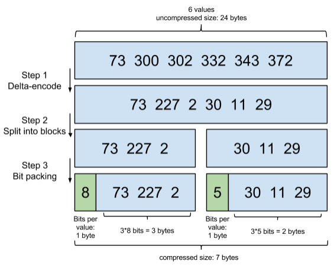
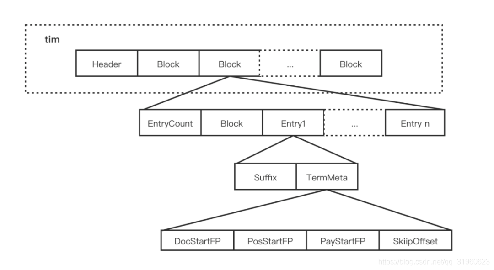
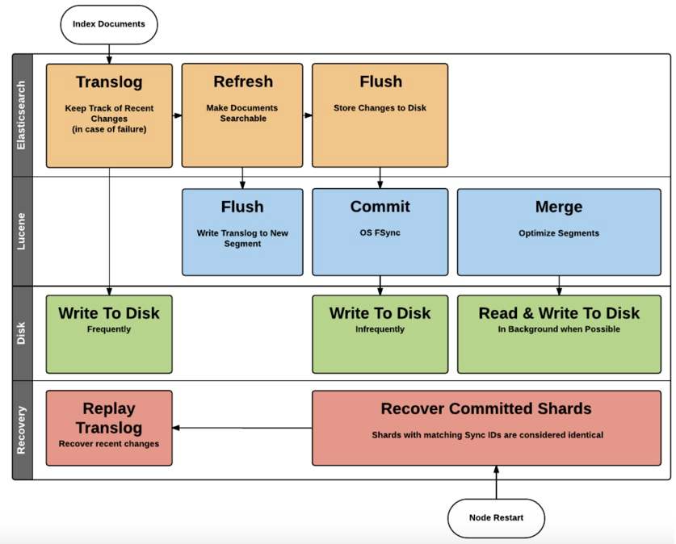

## es

## 前言
第一个公开版本在2010年2月发布, 产生了es公司

## 简介

是基于Lucene使用java语音开发的分布是开源搜索引擎, 通过resfulApi屏蔽了lucene的复杂性, 使全文搜索变得简单, 具有高性能与高拓展性, 支持pb级别的数据, 支持实时查询,
使用与结构化搜索, 全文检索, 日志时序分析等多种场景

## 基本概念,


名词| 解释 | 123
--|--|--
cluster集群| 一个或多个node集合, 节点间相互通信组成一个分布式系统|
node(节点)| 一个运行的es实例, |
index(索引) | 类比为table, 逻辑上是一对一组具有相同数据结构存储的抽象, 物理上可能存储在多个node上|
index mapping 映射,| schema. 描述了文档可能具有的字段或者属性, 每个字段的类型, 以及Lucene是如何存储这行字段的|
index settings 索引设置| 定义索引的sheard数, 分片数, , 刷新数据, 慢日志, 分词器等|
shard 分片| 为了支持更大数据量的存储, 一个索引可以分成多个部分, 分布到不同的node上存储, 这样的每一个部分称为一个shard, 一个索引分为几个shard是创建索引的时候就确定得, 后续无法更改, sheard可以分为primary shard 和replica shard|
primary shard 主分片| 数据写入/更新先写入主分片, 在写replica shard|
relica shard 副本分片| 一个车shard可以有0个或多个replica, primary shard 出现问题时 ,副本分片可以 变为主分片, 以保证高可用, 同时relica可以提供读服务, 拓展搜索吞吐量|
document 文档| mysql中的row , 一行数据, 一个json对象|
feild 字段 | column, 一列 |
cluster headlth | green 健康, yellow, 主分片可用, 部分副分片不可用, red, 部分主分片不可用, 数据会丢失|
Apache Lucene| 开源搜索库|


## 存储结构

倒排索引

由所有不重复词的列表构成, , 将每个文档创建成单独的词条, 创建一个包含所有不重复词条的排序列表, 然后列出每个词条出现在哪些文档中.


term: 关键字
分词: 将text分割成多个term的过程

postings list: 关键词对应的文档列表
    存储一个term对应的文档列表, postings list用到了FrameOfReference压缩技术来节省磁盘空间 分为增量编码, block分区. 位包装3部分
    * 增量编码: 将每个id转化为相对前一个id的增量值, [73, 300, 302, 332, 343, 372] -> [73, 227, 2, 30, 11, 29] 好处是?
    * block划分: 按每个block3个元素划分, [73, 227, 2, 30, 11, 29]
    * 位包装: 动态计算bits  为啥227是8bits? 30是bits? 节省空间吧   4byte 8bits ^6 24bits
    
term dictionary 词典, 保存term的有序列表, 可进行二分查找
    存储term数据, 同时他也是term与postings list的关系纽带, 存储了每个term和其对应的postings list文件位置指针
    .tim后缀存储, 内部采用NodeBlock对Term进行压缩前缀存储, 处理过程会将相同前缀的term压缩为一个NodeBlock, NodeBlock会存储公共前缀, 然后将每个term的后缀以及对应term的
    
    postings list 关联信息处理为一个Entry 保存对Block
term index: 对term dictionary的索引, 索引指向一个block, 里面存储了一些term dictionary片段, 二分这些片段
    使用FST(有限状态转移机)实现, FST基于前缀树(trie), 具有空间占用小, 查询速度快, 对模糊搜索支持好等优点. FST不但能共享前缀还能共享后缀, 大小可能只有term尺寸的几十分之一, 使得内存缓存整个term index成可能


StoreField
    字段原始内容存储, 默认存储原始json为_source, 同一篇文章的多个Field的Store会存储在一起, 检索时通过倒排索引搜索到DocId后, 将原始字段信息读出返回客户端, 同时在更新部分字段
    时, 需要通过store Field 读取原始数据, 与更新部分充足, 重新存储

Doc Values
    正排索引, 采用列式存储, 将单个字段的所有值一起存储在单个数据列中, 默认情况下, 除text之外的所有字段类型均启用Doc Values. 通过DocID可以快读读取到该Doc的特定值, 避免了从原始信息中
    再解析字段, 由于是列式存储,性能好, 用于排序, 聚合等需要高频读取Doc字段值的场景


img/es

### 分词器
将文本转换为一系列单词的过程, 而分词是通过分词器(Analyzer) 来实现的

* 组成
  * Character Filter(字符过滤器), 对字符按顺序通过每个字符过滤器, 在分词前整理整理字符串. 如: 如html &转and等
  * Tokenizer (分词器) 字符串被分词器分为单个词条.
  * tokenFilter(token过滤器) 词条按顺序通过每个token过滤器. 这个过程可能会改变词条, 删除词条, 或者增加词条


### 索引特性
* 不变性: 倒排索引被写入磁盘后是不可改变的
  * 不需要锁: 不更新就不需要担心多进程同时修改数据的问题
  * 一旦索引被读入内核的文件系统缓存, 就不需要更新, 大部分请求会直接请求内存, 而不会去磁盘
  * 部分缓存(filter缓存),在索引的生命周期内始终有效, 他们不需要再每次数据改变时被重建, 因为数据不会变化
  * 写入单个大的倒排索引允许数据被压缩, 减少磁盘IO和需要被缓存到内容的索引的使用量
  * 当需要更新时: 需要重建整个索引, 对索引包含的数据量或者可被更新的频率有限制
* 分段索引: 保留索引不变性的优势下, 实现索引的灵活和快速地更新,增加新的补充索引来反映新的修改,查询时多个索引再对结果进行合并
  * 一个es索引shard就是一个lucene索引, lucene引入了segment的概念, 将一个索引拆分为多个子文件, 每个子文件为一个segment,每个segment都是一个独立的可被搜索的数据集,写入硬盘不可修改
  * 新增: 当有新的数据需要创建索引时, 由于segment的不变性, 需要新增segemnt来存储新数据
  * 删除: lucene会维护一个.del文件, 用以存储被删除的数据id, 当一个文档被删除时, 只是在.del文件中被标记为删除, 他在segemnt中仍然可以被查询, 但是在最终结果返回前会被删除
  * 更新: 更新=删除+新增, 在.del中标记老版本的数据被删除, 并在新的segemnt中添加更新后的数据
* 近实时索引
  * lucene采用延迟写的策略, 先写入内存缓冲区, 一段时间后再对这批数据新建segment,一个新的segment需要fsync写入磁盘才可以保证在断点时不会丢失数据,但是fsync代价大, 频繁fsync会有性能问题, 先进segment写入到文件系统缓存中, 一段时间后写入磁盘, 写入文件系统缓存的代价比写入磁盘低, 但这时segment已经可以像其他文件一样被打开和读取了, 生成新segment的操作叫refresh
  * 默认的refresh_interval为1s,近实时就是说有1s延迟
* 持久化变更
  * segment在文件系统缓存还没写入磁盘中时,断点后数据会丢失.及时通过每秒刷新实现了近实时搜索, 为了能保证数据可靠性仍需要将segemnt刷到磁盘 translog(事务日志)
  * 默认情况想translog是每次请求都写磁盘, 根据translog恢复数据 索引flush后, 写入新的segemnt, 文件缓存中的被写入磁盘, translogs被删除
* 段合并
  * 由于每个refresh周期都会产生新的segment, 每一个segment都会消耗文件句柄, 内存和cpu运行周期, 搜索时需要轮询检查每个segment O(n)
  * 后台通过段合并来解决问题, 将小的segemnt合并到大segment, 段合并时会将在新的segment中将已存在.del文件中标记删除的文档清除
  

### 写入流程
* lucene 写入
  * 这里的segment是倒排索引的抽象,并不代表就一个文件, lucene在构建索引时会生成invert index(倒排索引, 包含term index,term dictionary, postings list..), storeFileds(正排索引, 字段原始内存存储, 行式存储), docValues(正排索引, 列式冲刺)
* 分布式写入
  * index分为多个shard, 写入公式: shard=hash(routing) % number_of_primary_shards(主分片数量), routing : 默认是文档的_id,可以自定义, 这也是为什么要在创建索引的时候就确定好主分片的数量并且永远不会改变的原因, 如果数量变化, 所有之前路由的值都会无效, 文档再也找不到  (nginx , 环形? )
  * 请求发给主分片-> 主分片同时发给副分片 -> 副分片成功后返回给主分片 -> 主分片返回客户端
    * 主分片出错 -> 主分片所在的节点会发送消息给master节点 -> master节点提升一个副分片成为主分片. 再发送请求? master也会监控节点的健康状态, 比如: 主分片离线时, 对主分片做主动降级
    * 副分片出错 -> 主分片会发送消息给master节点, 请求将副分片移除, 在新的节点上建立分片  触发规则?

### 查询流程
* Lucene查询
  * 倒排索引: 通过term index, term dictionnary找到匹配的posting list
  * 倒排合并: 对多条件查询, 使用跳表对多个posting list进行合并
  * 排序与集合: 通过docValue, 读取指定doc的对应字段, 进行排序和聚合
* 分布式查询
  * es通过shard实现分布式, 数据写入根据_routing规则将数据写入某一个shard中, 导致查询时候数据可能index的所有shard中, es需要查询所有shard, 同一个shard的主副选一个, 查询请求会分发给所有shard, 每个shard中都是一个独立的查询引擎, eg: 查询top10的结果, 每个shard都会返回自己top10的结果, 然后在clientnode里面接受所有shard的结果, 然后通过优先级队列二次排序, 选择出top10 返回
* get与Search 精确和模糊查询
  * Search: 一起查询内存和磁盘上的Segment,最后将结果合并后返回, 这种查询时近实时的, 主要是由于内存中的index数据需要一段时间后才会刷新为Segment
  * get: 先查询内存中的tanslog, 没找到再去磁盘的tanslog, 再去segment, 实时查询, 保证数据写入后可查
* 两阶段查询
  * query_then_fetch 查docid 再查完整文档
  

### 分布式
* 选举
  * 3种状态: Leader, Candidate, Follower, 初始为Candidate
  * Candidate发起prevote请求, 等待获取最大term , 通过引入prevote消除了不知要term增加和无意义的选举
  * 收集preVote响应, 只有大多数节点同意选举时,才进行真正的选举
  * 发起正式Vote请求, 等待其他节点响应
  * 收集正式投票结果, 成为learder或者重新选举
  * 转换状态
    * 1. 初始为Candidate状态, 如果discovery发现集群已经存在leader, 则直接加入集群, 切换到Follow状态
    * 2. 如果Candidate收到足够的投票, 则转换为Leader
    * 3. 当一个Leader收到RequestVote, 或者发现了更高的term, 则辞去Leader, 切换为Candidate
    * 4. Leader不能直接变成Follower, 他需要先切换到Candidate

* Sequence IDs
  * PrimaryTerms和: 由master节点分配, 当一个主分片被提升时, primary terms递增, 然后持久化到集群状态中, 从而表示集群主分片所处的一个版本. 有了PrimaryTerms, 来自就的主分片的迟到的操作就可以被检测然后拒绝, 避免混乱的情况
  * SequenceNumbers: 标记发生在某个分片上的写操作, 由主分片分配, 只对写操作分配, 使我们能够理解发生在主分片节点上的索引操作的特定顺序
  * global checkpoint: 全局检查点是所有活跃分片历史都已对齐到的序列号, 所有低于全局检查点的操作都保证已被所有活跃分片处理完毕. 这意味着当主分片失效, 我们只需要比较新主分片与其他副分片之间的最后一个全局检查点之后的操作, 当旧主分片恢复时, 我们使用他知道的全局检查点, 与新主分片进行比较, 就可以知道落后的数据, 主分片负责推进全局检查点, 他通过跟踪在副分片上完成的操作来实现, 一旦他检测到所有副分片已经超出他给定的序列号, 他将相应的更新全局检查点. 副分片不会跟踪所有操作, 而是维护一个类似全局检查点局部变量,成为本地检查点,
  * local checkpoint:也是一个序列号,所有序列号低于他的操作都已经在该分片上处理(lucene和translog写成功, 不一定刷盘) 完毕, 当副分片ack一个写操作到主分片节点时,他们也会更新本地检查点. 使用本地检查点, 主分片节点能够更新全局检查点, 然后在下一次索引操作时将其发送到所有分片副本

### 数据恢复
* 主分片
  * 系统的每次flush操作会清理相关translog, 因此translog中存在的数据就是lucene索引中尚未刷入的数据, 主分片的recovery就是把translog中的内容转移到lucene. 对translog重放每条记录,调用标准的index操作创建或更新doc来恢复
* 副分片
  * 当一个故障时,es会将其移除,当故障超过一定时间,es会分配一个新的分片到新的node上, 此时需要全量同步数据. 但是如果之前故障的分片回来了, 就可以只回补故障之后的数据, 追平后加回来即可, 实现快速恢复,实现快速故障恢复的条件有2个, 一个是能够保存故障期间所有的操作以及顺序,另一个是能够知道从哪个点开始同步数据. 第一个可以通过保存一定时间的translog实现,第二个条件可以通过checkpoint实现
[你好]


一直写translog 没有性能问题?


docker 创建es 测试服务

<!-- tabs:start -->

#### master
```shell

for port in $(seq 1 3); \
do \
mkdir -p ~/work/es/docker_es/es/master-${port}/config
mkdir -p ~/work/es/docker_es/es/master-${port}/data
chmod -R 777 ~/work/es/docker_es/es/master-${port}
cat <<EOF >~/work/es/docker_es/es/master-${port}/config/elasticsearch.yml
cluster.name: my-es
node.name: es-master-${port}
node.master: true
node.data: false
network.host: 0.0.0.0
http.host: 0.0.0.0
http.port: 920${port}
transport.tcp.port: 930${port}
discovery.zen.ping_timeout: 10s
discovery.seed_hosts: ["172.20.12.21:9301","172.20.12.22:9302","172.20.12.23:9303"]
cluster.initial_master_nodes: ["172.20.12.21"]
EOF

docker run --name es-master-${port} \
-p 920${port}:920${port} -p 930${port}:930${port} \
--network=esnet --ip 172.20.12.2${port} \
-e ES_JAVA_OPTS="-Xmx300m -Xms300m" \
-v ~/work/es/docker_es/es/master-${port}/config/elasticsearch.yml:/usr/share/elasticsearch/config/elasticsearch.yml \
-v ~/work/es/docker_es/es/master-${port}/data:/usr/share/elasticsearch/data \
-v ~/work/es/docker_es/es/master-${port}/plugins:/usr/share/elasticsearch/plugins \
-d elasticsearch:7.8.1

done
```


#### node

```shell
for port in $(seq 4 6); \
do \
mkdir -p ~/work/es/docker_es/es/node-${port}/config
mkdir -p ~/work/es/docker_es/es/node-${port}/data
chmod -R 777 ~/work/es/docker_es/es/node-${port}
cat <<EOF >~/work/es/docker_es/es/node-${port}/config/elasticsearch.yml
cluster.name: my-es
node.name: es-node-${port}
node.master: false
node.data: true
network.host: 0.0.0.0
http.host: 0.0.0.0
http.port: 920${port}
transport.tcp.port: 930${port}
discovery.zen.ping_timeout: 10s
discovery.seed_hosts: ["172.20.12.21:9301","172.20.12.22:9302","172.20.12.23:9303"]
cluster.initial_master_nodes: ["172.20.12.21"]
EOF

docker run --name es-node-${port} \
-p 920${port}:920${port} -p 930${port}:930${port} \
--network=esnet --ip 172.20.12.2${port} \
-e ES_JAVA_OPTS="-Xms300m -Xmx300m" \
-v ~/work/es/docker_es/es/node-${port}/config/elasticsearch.yml:/usr/share/elasticsearch/config/elasticsearch.yml \
-v ~/work/es/docker_es/es/node-${port}/data:/usr/share/elasticsearch/data \
-v ~/work/es/docker_es/es/node-${port}/plugins:/usr/share/elasticsearch/plugins \
-d elasticsearch:7.8.1

done

```

<!-- tabs:end -->


* https://www.zhihu.com/column/Elasticsearch
* https://www.zhihu.com/column/c_1392559802560634880
* https://www.elastic.co/guide/cn/elasticsearch/guide/current/index.html
* https://easyice.cn/archives/332
* https://blog.csdn.net/qq_31960623/article/details/118860928
* https://www.elastic.co/cn/blog/frame-of-reference-and-roaring-bitmaps
* https://zhuanlan.zhihu.com/p/76485252
* https://www.shenyanchao.cn/blog/2018/12/04/lucene-fst/
* https://www.cnblogs.com/sessionbest/articles/8689030.html
* https://blog.csdn.net/laoyang360/article/details/108970774
* https://easyice.cn/archives/300#Primary_Terms_Sequence_Numbers
